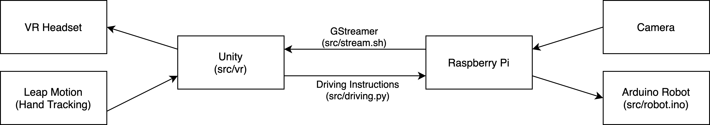

# VR Robot Kart with Hand Tracking

Prototype of a robot car connected to a VR headset and drivable through hand movements captured by a leap motion.

## Demo

## Running

1. Load [OS](https://www.raspberrypi.org/software/) into SD card of the RPi
2. Connect RPi to the robot (USB) and camera (camera module port)
3. Load [`robot.ino`](src/robot.ino) into the arduino
4. Run [`driving.py`](src/driving.py) and [`stream.sh`](src/stream.sh) in the RPi (don't forget to change to your IP)
5. Run VR project in Unity

## Architecture

Technologies:
- Python (driving interface between VR and robot w/ sockets)
- Unity (virtual reality environment)w
- Arduino (robot driving)
- Ultraleap Tracking (hand tracking)
- GStreamer (streaming interface between VR and robot)
- Autodesk Maya (3D graphics)

## License

This project is licensed under the MIT License - see the [`LICENSE.md`](LICENSE.md) file for details.

## Contributors

- Emmanuel Bustos ([@ema2159](https://github.com/ema2159))
- Iacopo Catalano ([@IacopomC](https://github.com/IacopomC))
- Miguel Magalhães ([@magamig23](https://github.com/magamig23))
- Valeria Acevedo ([@bideckerz](https://github.com/bideckerz))